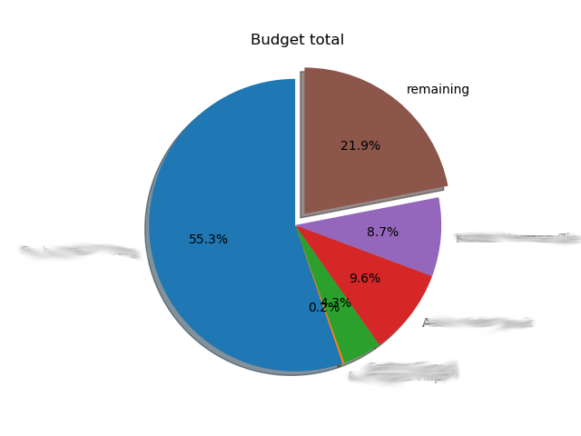

# maconomy2python

follow the instructions at https://stash.code.sintef.no/projects/SPY/repos/sintefpy/browse, which are:
 - git clone ssh://git@git.code.sintef.no/spy/sintefpy.git
 - cd sintefpy/
 - pip install --user .

example usage1: python plotprojectdata.py --projectnumber 123 --totalbudget 1000

example output:

example usage2: python plotprojectdata.py --filename ExportProjectCard_projectnumber.xlsx --totalbudget 1000

TODO: set start and end date to be considered via command line option

